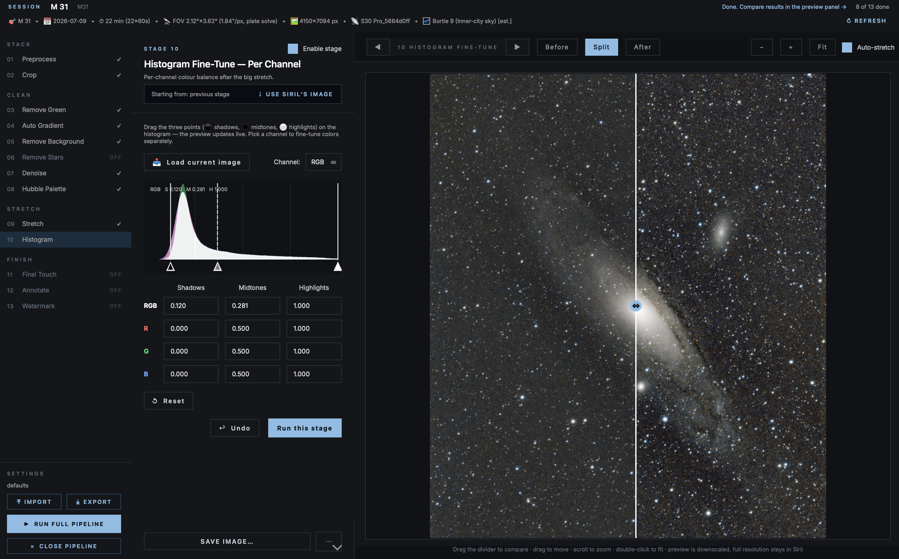

# S30 Pro Pipeline

**One-click astrophotography processing for smart telescopes, inside Siril.**

A single Python script that takes the raw files from your smart telescope
(ZWO Seestar S30 Pro / S30 / S50, Dwarf, Celestron Origin, Unistellar…) and
turns them into a finished picture — through guided stages with live
before/after previews, an undo button for every step, and settings you can
save and share as JSON.

Built on top of three excellent open-source projects, all credit to their authors:

| Component | Author | Source |
|---|---|---|
| Smart Telescope Preprocessing | Nazmus Nasir | [Naztronomy.com](https://www.naztronomy.com) |
| GraXpert AI (background & denoise) | Adrian Knagg-Baugh / GraXpert Team | [graxpert.com](https://graxpert.com) |
| VeraLux HyperMetric Stretch | Riccardo Paterniti | info@veralux.space |

License: **GPL-3.0-or-later** (same as all three source scripts).
GraXpert AI models are licensed CC-BY-NC-SA-4.0.



---

## The big picture — what actually happens to your photo

A telescope doesn't take one pretty picture. It takes **hundreds of short,
noisy, dark exposures** ("subs"). Processing is the art of combining them and
progressively cleaning the result. Here is the whole journey, in order:

```
 raw files → [1] Stack → [2] Crop & de-green → [3] SCNR
           → [4] Auto gradient removal → [5] Remove background glow
           → [6] Remove stars → [7] Denoise → [8] (optional) Hubble palette
           → [9] Stretch → [10] Histogram fine-tune → [11] Final touch
           → [12] Annotate → [13] Watermark
```

| # | Stage | What it does | Why you need it |
|---|-------|--------------|-----------------|
| 1 | **Preprocess** | Aligns and averages hundreds of subs into one deep image ("stacking"), then calibrates the colors against star catalogs (SPCC). Stacking method can be Average / Median (Milky Way Mode) / Sum, or **Comet Stack** for moving objects — see below. Optionally combines the result with an already-stacked master from an earlier session (no raw subs needed), weighted by sub count | One 10-second exposure is faint and noisy. Averaging 300 of them is like exposing for 50 minutes — the signal adds up, the random noise cancels out |
| 2 | **Crop** | Trims the messy edges — with an optional rotate (slider + degree number) applied first | Because the telescope drifts slightly between shots, the stacked edges are ragged. Rotating first lets you square up the frame before trimming |
| 3 | **Remove Green (SCNR)** | Removes the green color cast | Color cameras tend to produce a greenish sky that isn't really there |
| 4 | **Auto Gradient Removal** | A second, tunable gradient-flattening pass (scale, smoothness, structure protection, optional simplified polynomial model) — same engine as the standalone AutoGradientRemoval script, now built in | Useful either on its own or as a milder pre-pass before stage 5's heavier background removal, especially for wide, uneven sky glow |
| 5 | **Remove background** | Flattens the sky glow (light pollution, moonlight) using GraXpert's AI or Siril's built-in gradient removal. For Siril's subsky method, an interactive canvas lets you preview and hand-edit which sample boxes get used, instead of relying purely on automatic placement | City lights make one corner of your sky brighter than another. Removing this gradient makes the real object stand out |
| 6 | **Remove Stars** | Separates stars from the rest of the image (StarNet) | Lets later stages (like Hubble palette) work on nebulosity without the stars getting in the way |
| 7 | **Denoise** | AI noise reduction (GraXpert) | Even after stacking, faint areas are grainy. The AI knows what noise looks like and removes it while keeping stars and detail |
| 8 | **Hubble palette** *(optional)* | Remixes the colors of emission nebulae into the famous gold-and-teal "Hubble look", optionally protecting the stars with StarNet. Has an optional "GIMP replacement polish" block (saturation, shadows, highlights, contrast, sharpen, denoise) for the manual finishing touches that used to require a trip through GIMP | Nebula gases glow at very specific colors. Re-mapping them reveals structure your eyes would never see — this is how the iconic NASA images are made |
| 9 | **Stretch** | Brightens the image from "almost black" to visible, without destroying colors (VeraLux) | Cameras record linearly, but deep-sky objects are ~1000× fainter than what a screen shows. Stretching lifts the faint signal into the visible range |
| 10 | **Histogram fine-tune** | Interactive per-color-channel adjustment with a draggable histogram | After the big stretch, small color balance corrections make the difference between "okay" and "wow" |
| 11 | **Final touch** | Brightness / contrast / saturation / sharpening — like editing a phone photo | The familiar last-mile polish, with live preview |
| 12 | **Annotate** | Labels stars and deep-sky objects (Messier/NGC/IC/Sharpless/LdN) in the field, with per-catalog colors and a select/deselect list, plus a one-click "Remove all annotations". Marker style can be a Circle, an Open Cross (a reticle that stops short of the object so it stays unobscured), or both, each with independent thickness/color controls | Turns a plate-solved image into a labeled reference view; pick exactly which objects to show, then save the annotated frame |
| 13 | **Watermark** | Draws a semi-transparent info block (object, date, telescope, your own "Author" credit line, etc.) onto the image | Great for sharing — keeps your attribution and shot details attached to the picture |

**Comet Stack mode** (Preprocess's "Stacking method" dropdown): for comets
and asteroids, where the object moves against the stars between subs. It
produces a comet-sharp stack and a stars-sharp stack from the same subs,
then combines them so both look sharp — something none of the other
stacking methods can do, since they only ever produce one stack aligned
one way. Picking it auto-disables Remove Background and Remove Stars
below it (Comet Stack already does both itself). It also pauses **twice**
partway through for a few seconds of manual work in Siril's own window,
with clear on-screen instructions each time — these two steps genuinely
have no console-command equivalent, so they can't be automated away:
1. **Comet registration** — pick the comet's nucleus on the first and
   last frame in Siril's Registration tab ("Comet/Asteroid registration").
2. **Star Recomposition** — combine the comet stack and star stack in
   Image Processing → Star Processing → Star Recomposition.

Click Continue after each, and the rest of the pipeline (Stretch,
Histogram, Final touch, Annotate, Watermark, ...) picks up the
recomposited result and runs exactly as it would for any other stacking
method.

Every stage shows a **before/after comparison** (drag the divider!) and can be
**undone**. Every stage also has a small "Use Siril's image" button to pull in
whatever's currently loaded in Siril — handy if you did something outside
the pipeline and want to continue here. Run stages one at a time, or tick
the ones you want and hit **Run Full Pipeline**.

---

## Prerequisites — do these once, in this order

### 1. Install Siril (required)

The script runs *inside* [Siril](https://siril.org), the free astrophotography
program. **Version 1.4 or newer** is required (older versions can't run Python
scripts).

- Download: <https://siril.org/download/>
- macOS: drag Siril to Applications. On first launch you may need to
  right-click → Open to pass Gatekeeper.

### 2. Organize your files (required)

Create a folder for your imaging session with this structure. The `lights`
folder (your actual photos) is mandatory; the others are optional calibration
frames:

```
MySession/
├── lights/     ← your exposures (required)
├── darks/      ← optional: exposures with the cap on (helps remove sensor heat noise)
├── flats/      ← optional: exposures of a uniform surface (removes dust shadows & vignetting)
└── biases/     ← optional: shortest possible exposures (removes electronic readout noise)
```

**Why:** stacking software needs to know which file is which. Smart telescopes
usually give you the lights automatically — on a Seestar, copy the contents of
its `MyWorks/<target>` sub-folder into `lights/`.

### 3. Install GraXpert and download its AI models (required for stages 5 & 7)

The background-removal and denoise stages use GraXpert's neural networks. The
script runs the models directly, but **the model files must already be on your
computer**, and GraXpert is the tool that downloads them.

1. Install GraXpert: <https://graxpert.com>
2. Open GraXpert once, load any image, and run **Background Extraction** with
   the AI method and **Denoising** one time each — this makes GraXpert download
   the model files (a few hundred MB).
3. Done. The pipeline will now find the models automatically (they live in
   GraXpert's data folder, e.g. `~/Library/Application Support/GraXpert` on macOS).

**Why:** the AI models are large and license-restricted, so they are fetched by
GraXpert itself rather than bundled with any script.

*No GraXpert? Stage 5 also offers Siril's built-in background removal
(polynomial / RBF) which needs nothing extra — but stage 7 (AI denoise)
requires the GraXpert model.*

### 4. Download the local Gaia star catalogs (strongly recommended)

Two things need star catalogs: **plate solving** (figuring out exactly where
in the sky your image is — required for mosaics and annotation) and **SPCC**
(calibrating colors against the true, measured colors of stars).

1. Download the catalogs from the Siril site:
   <https://siril.org/download/#catalogues> (astrometry catalog = one file,
   photometry catalog = a folder).
2. In Siril: **Preferences → Astrometry**, point the two "Gaia" fields at what
   you downloaded.
3. The pipeline shows a live status line — ✅/❌ for each catalog — in stage 1.

**Why:** without the astrometry catalog, mosaic panels can't be matched
precisely (the script falls back to simple star alignment). Without the
photometry catalog, SPCC uses a slower online lookup.

### 5. Install StarNet++ (optional — only for star removal in stage 6)

The Hubble-palette stage can remove stars before recoloring and put them back
afterwards (prevents ugly magenta stars). This uses **StarNet++**, a free
neural network.

1. Download the **command-line version** for your OS:
   <https://www.starnetastro.com/download/>
2. Unzip it somewhere permanent.
3. **macOS only — grant permission to run** (Terminal):
   ```bash
   cd /path/to/StarNetCLI
   chmod +x starnet++ run_starnet.sh          # make it executable
   xattr -dr com.apple.quarantine .           # remove the "downloaded from internet" quarantine
   ```
   **Why:** macOS blocks unsigned binaries downloaded from the web; these two
   commands mark StarNet as executable and trusted.
4. In Siril: **Preferences → Miscellaneous → StarNet executable**, point it at
   the `starnet++` binary (or `run_starnet.sh` on macOS).

### 6. Install local Astrometry.net / `solve-field` (optional — enables the plate-solve fallback, especially for Milky Way Mode)

The Preprocess stage's plate-solve step (used for SPCC and for Annotate's
WCS) already retries with a local Astrometry.net solve if Siril's own
solver fails, and — for "Median (Milky Way Mode)" stacking specifically —
retries once more with a full blind solve if that also fails. Neither
fallback does anything unless a local Astrometry.net install is actually
present: without it, Siril just reports the failure and SPCC/Annotate are
skipped for that run.

1. Install the solver:
   - macOS (Homebrew): `brew install astrometry-net`
   - Windows: install [ansvr](http://ansvr.astrometry.net/)
   - Linux: `sudo apt install astrometry.net` (Debian/Ubuntu) or your
     distro's equivalent package
2. Download index files matching your field of view from
   <http://data.astrometry.net/>. Astrometry.net's own rule of thumb:
   grab index files whose skymark size is 10%–100% of your field width.
   - Tele camera (~4.6° FOV): `index-4108` through `index-4114` cover it
     comfortably.
   - Wide/Milky Way camera (~60–70° FOV): use `index-4116` through
     `index-4119` — the widest pre-built indexes available. This repo
     includes `download_wide_field_index.sh` to fetch and MD5-verify
     these four files automatically (auto-detects Homebrew's index
     directory, or pass a path as an argument).
3. Confirm `solve-field`'s own config file — `astrometry.cfg`, e.g.
   `/opt/homebrew/etc/astrometry.cfg` on Apple Silicon Homebrew — has an
   `add_path` line pointing at wherever you put the index files. **This
   is separate from Siril's own setting**, which only needs to know
   where the `solve-field` binary itself lives, not the index files.
4. In Siril: **Preferences → Astrometry**, point the local Astrometry.net
   path at the `solve-field` binary's folder (e.g. `/opt/homebrew/bin` on
   Apple Silicon Homebrew).
5. Sanity-check outside Siril first, so you get real diagnostics instead
   of Siril's one-line summary:
   ```bash
   solve-field --scale-units degwidth --scale-low <X> --scale-high <Y> -v your_stacked.fits
   ```
   The verbose (`-v`) output lists exactly which index files were
   loaded before it starts searching — the fastest way to confirm the
   setup is right. (Run this from a regular Terminal, not Siril's own
   command box — `solve-field` is an external program, not a Siril
   command.)

**Why:** Siril's own plate-solve algorithm sometimes fails on stacked
Seestar images (even ones that solve fine on nova.astrometry.net), and
reliably fails on Milky Way Mode's very wide stacked field using a
header-hinted near-search. A local Astrometry.net install lets the
pipeline's automatic fallbacks actually do something instead of just
reporting the failure.

### 7. Internet on first run (automatic)

The first time you run the script, Siril's Python environment automatically
installs the libraries it needs (PyQt6, NumPy, Astropy, OpenCV, ONNX
Runtime). This takes a few minutes once, then it's cached. The optional
"all stars < mag 6" annotation mode also queries an online star catalog when
used.

---

## Installing the script

> **Since v1.43.0** the script is split into `S30Pro_Pipeline.py` plus a
> `s30pro_pipeline/` folder of helper modules that must sit right next to
> it. Always copy (or clone) both together — the script won't start if
> `s30pro_pipeline/` is missing.

**Option A — Scripts menu (recommended)**

1. Copy `S30Pro_Pipeline.py` **and** the `s30pro_pipeline/` folder into
   Siril's scripts folder:
   - macOS: `~/Library/Application Support/org.free-astro.Siril/scripts`
   - Windows: `%LOCALAPPDATA%\siril\scripts`
   - Linux: `~/.local/share/siril/scripts`
   (You can also add any folder under **Preferences → Scripts** and press the
   refresh icon.)
2. Restart Siril → the script appears in the **Scripts** menu.

**Option B — no install**

In Siril's command line (with `s30pro_pipeline/` in the same folder as the
script):
```
pyscript /path/to/S30Pro_Pipeline.py
```

---

## Quick start

1. In Siril, set the working directory to your session folder (the one that
   *contains* `lights/`), or just launch the script — it will ask.
2. Launch **S30Pro_Pipeline** from the Scripts menu.
3. The script auto-detects your telescope from the file headers. Check the
   stage cards, tick/untick what you want (sane defaults are pre-selected).
4. Press **▶ Run Full Pipeline** — or run stage by stage and inspect each
   before/after with the draggable split view.
5. Finished files are saved into your session folder (`*_stacked`,
   `final_stretched_*`, `final_touched_*`, `annotated_*.jpg`).

Tip: **⤓ Export settings** saves every knob to a JSON file — keep one per
target type (galaxy / nebula / Hubble palette) and re-import anytime.

---

## Troubleshooting

| Symptom | Fix |
|---|---|
| Script not in the Scripts menu | Siril must be ≥ 1.4; check the folder is listed in Preferences → Scripts; rescan/restart |
| "No GraXpert model found" | Run GraXpert once and execute AI background extraction + denoising so it downloads its models (step 3) |
| "StarNet failed" | Check step 5: executable permissions (macOS `chmod`/`xattr`) and the path in Preferences → Miscellaneous |
| Gaia shows ❌ | Download catalogs and set paths in Preferences → Astrometry (step 4) |
| "No valid plate-solve solution" in Annotate | Keep SPCC enabled in stage 1, or run Siril's `platesolve` on the image first |
| First run is very slow | Python dependencies are installing — one-time only |
| Mosaic panels misaligned | Astrometry Gaia catalog missing (step 4); without it the script falls back to simple registration |
| "Astrometry.net fallback also failed" / mentions `-localasnet` in the log | Local Astrometry.net isn't installed, or has no index files for your field — see step 6 |
| Stacked image still won't plate-solve even with `-localasnet` | Confirm `astrometry.cfg`'s `add_path` actually points at your index-file folder (step 6.3) — Siril's "path" setting only locates the `solve-field` binary, not the indexes |
| "Plate Solving failed. The image could not be aligned with the reference stars" on a Milky Way Mode stack | Very wide (~60–70°) fields usually need the wide-field index files (`download_wide_field_index.sh`) plus a full blind solve — the pipeline already retries this automatically (1.41.0) as a last resort, but you need those index files installed for it to succeed |
| `solve-field: command not found` when typed into Siril's own command line | `solve-field` is an external program, not a Siril command — run it from a regular Terminal window instead |

---

## Changelog

The script's own docstring only keeps a short summary of the last few
releases. Full version history lives in [`CHANGELOG.md`](CHANGELOG.md).

Recent highlights:

| Version | Highlights |
| --- | --- |
| 1.46.0 | Annotate: new "Marker style" option — Circle (unchanged default), Open Cross (a reticle that stops short of the object so it stays unobscured), or both together — with independent thickness/color controls for each, a cross gap/arm length that scale with the object's own marker size, and a Label position (NE/NW/SE/SW/Auto) so Open Cross labels can prefer one of the 4 corners its arms leave clear. |
| 1.45.0 | New "Comet Stack" stacking method in Preprocess, for comets and asteroids: produces a comet-sharp stack and a stars-sharp stack from the same subs (two separate registrations, since a moving object needs star-based alignment for one and its own motion for the other) and combines them. Pauses twice for brief manual steps in Siril's own window (comet registration, Star Recomposition) that have no console-command equivalent — see the big-picture table above for details. |
| 1.42.0 | Annotate's constellation lines and name labels now have independent colors (separate "Line color..." / "Name color..." pickers), plus a new "Color preset" dropdown with six curated matched color schemes (Pale Lavender, Sky Blue, Warm Gold, Classic White, Muted Red, Soft Green) to quick-pick from. Picking a preset sets both colors; picking either color manually switches the dropdown back to "Custom". Both colors round-trip through Export/Import settings. |
| 1.41.0 | Milky Way Mode's SPCC plate-solve step now falls back a step further: if the plain `-localasnet` attempt (1.40.0) also fails, it retries once more with `-blindpos -blindres` (full blind Astrometry.net solve) before giving up — confirmed by hand that the wide ~60-70° stacked field reliably needs a blind solve rather than the header-hinted near-search, even with the right index files installed. Only runs once on the final stack, not per-frame. |
| 1.40.0 | Fixed stacked Seestar images failing to plate-solve ("No valid plate-solve solution" during Annotate) even though the same image solves fine on nova.astrometry.net — the SPCC plate-solve step now retries once with `-localasnet` (local Astrometry.net) before giving up. Also: "Median (Milky Way Mode)" stacking now passes the wide camera's real optics (6mm focal length, ~1.7 micron pixel size) to every plate-solve call instead of trusting the header, since some firmware versions carry the tele camera's values (160mm / 2.9 micron) into wide-camera FITS headers. |
| 1.39.0 | Control panel narrowed to roughly 1/3 of the window width (was fixed at a wider pixel width), with every stage's layout reworked to stay fully readable at that width — no horizontal scrolling needed. Wide multi-column grids collapsed to 2 columns, long non-wrapping button/checkbox labels shortened, stage headers reflowed so long titles don't force the row wider, and the splitter now resizes proportionally (1:2) instead of pinning the left panel at a fixed width. |
| 1.38.0 | The bottom 4 buttons (Save File / Export settings / Reset / Close Pipeline) are now split across two rows of 2 instead of one row of 4, so the left panel isn't as wide. Order unchanged. |
| 1.37.0 | Annotate: new "Constellation lines" option draws stick-figure lines (and optional name labels) between bright stars for the 88 IAU constellations, from a fully offline embedded dataset — configurable line width, color, gap (so lines don't touch the stars), and a "Select constellations..." dialog to leave specific ones out. A separate layer from the DSO/star markers, unaffected by "Select objects to show..."/"Remove all annotations". |
| 1.36.0 | Stacking method: "Median" relabeled "Median (Milky Way Mode)" so the recommended choice is visible at a glance, plus per-item hover tooltips on the dropdown. Button row reorganized: Export settings moved to the bottom row (Save File / Export settings / Reset / Close Pipeline), and a new Reset button resets all settings to defaults, clears previews/undo history, and re-prompts folder selection for a fresh pipeline run. |
| 1.35.0 | Fixed: Median/Sum stacking crashed ("Cannot upscale or maximize framing with median stacking" then "input images have different sizes"). Siril's `-maximize` framing only works with Average — Median/Sum now use `-framing=min` (crop to common overlap) instead, guaranteeing uniform frame sizes. Feather, Normalize on overlaps, and Stack weighting auto-grey out for Median/Sum since none apply there. |
| 1.34.0 | Fixed: Preprocess's main registration step now falls back to star-based registration when plate-solving fails ("Image ... did not solve") instead of continuing with broken/missing registration data — a real crash with very wide fields like Seestar's Milky Way Mode. |
| 1.33.0 | Preprocess: new "Stacking method" dropdown (Average w/ rejection / Median / Sum, default Average — unchanged). Median is recommended for Seestar's Milky Way Mode and other wide, trail-prone shots, since it's more robust than sigma-clip rejection at erasing a satellite/plane trail that only shows up in a few frames. |
| 1.32.0 | Watermark: the Integration time field now has a Minutes / Hours / Seconds unit dropdown (default: Minutes). |
| 1.31.0 | Preprocess: new "Normalize on overlaps" checkbox (Siril's `-overlap_norm`) next to Feather in the mosaic settings, for when tiles have very different content and a seam persists with plain normalization. The per-frame background removal ("Per-frame background (mosaic seams)") also gained a Degree spinner (1–4, was hardcoded to linear/degree-1) for panels with a more complex gradient than a flat tilt. |
| 1.30.0 | Crop stage gained a rotate slider (before crop). New "Auto Gradient Removal" stage (4 of 13), a built-in port of the standalone AutoGradientRemoval script. Remove Background's Siril-subsky method now has an interactive canvas to preview and hand-edit which sample boxes get used. Every stage got a "Use Siril's image" button to pick up work done outside the pipeline. Annotate got a one-click "Remove all annotations" button. |
| 1.29.5 | Combine with existing master: total integration time is now the true sum of both sessions' subs (not just Siril's naive 2-frame STACKCNT), patched into the combined result's header before it's loaded. The auto-saved filename also now gets a "_combined" suffix instead of "_stacked" when combine ran. |
| 1.29.4 | 1.29.3's `set32bits`+load/save fix for the "input images have different precision" crash didn't actually work — replaced it with a direct Python-level fix (`_ensure_float32_fits`, using astropy) that rewrites both frames to genuine normalized 32-bit float before Siril ever sees them. |
| 1.29.3 | Fixed yet another follow-on crash in "Combine with existing master": `Stacking error: input images have different precision`. Siril's `convert` only symlinks/copies FITS files as-is, it doesn't unify bit depth — now forces `set32bits` and re-saves both frames before converting/stacking so they're both guaranteed 32-bit float. |
| 1.29.2 | Fixed a follow-on crash from 1.29.1's fix: `stack` failed with "Unexpected argument to stacking `-weight_from_nbstack'" — that flag syntax isn't recognized by this Siril build. Switched to `-weight=nbstack`, matching the syntax Preprocess's own weighting option already uses successfully. |
| 1.29.1 | Fixed "Combine with existing master" crashing with a `seqapplyreg` "identity matrices" error when registering two independently-processed masters. Now prefers plate-solve registration (WCS-based, more robust across sessions) when Gaia astrometry is available, falls back to star-based registration, and if both fail, stacks without re-aligning instead of crashing — with a clear warning to check for misalignment. |
| 1.29.0 | Preprocess: new "Combine with an existing master" option — for a stacked FITS from an earlier session with no saved raw subs. Registers it against this run's fresh stack and combines with Siril's `-weight_from_nbstack`, weighted by each session's `STACKCNT` header (with a manual override for masters missing one), instead of averaging two very different amounts of integration time 50/50. |
| 1.28.2 | Fixed a Qt startup warning about a missing "Segoe UI" font family (platforms without it, e.g. Linux) — switched the global stylesheet to the generic `sans-serif` font family. No visual change. |
| 1.28.1 | The "GIMP replacement polish" block is now collapsed by default (click to expand), with a trimmed description. UI consistency pass: unified "Reset" button labels and slider value-readout widths across all stages. |
| 1.28.0 | Hubble Palette: added an optional "GIMP replacement polish" block — Saturation, Shadows, Highlights, Contrast, Sharpen, and Denoise, all independently tunable and off by default — porting the manual GIMP finishing pass from the Rosette Nebula tutorial workflow into one repeatable step instead of a manual TIFF round-trip through GIMP. |
| 1.27.0 | Annotate: object markers are now sized to the real apparent diameter (OpenNGC's MajAx / VizieR's Diam / Area, converted through the plate-solve's pixel scale) instead of a fixed circle. Also replaced the fixed offset label placement with a smart layout pass that avoids overlapping labels and guarantees no label gets cut off at the image edge, even in crowded fields or near the frame border. |
| 1.26.0 | Annotate is back (stage 11 again, Watermark moves to 12) — rebuilt on OpenNGC (Messier/NGC/IC, cached locally) and VizieR cone-searches (Sharpless, Lynds Dark Nebulae) instead of Siril's `catsearch`. Checkboxes to pick which catalogs to plot, each with its own color; a "Select objects to show..." dialog lets you tick/untick individual objects with the preview updating live; Undo and "Save annotated image..." are both back. |
| 1.25.0 | Removed the Annotate stage entirely — resolving Siril's bundled DSO catalogs reliably from a script never panned out. Siril's own Annotate tool (Tools → Astrometry → Annotate...) remains the way to label objects. Watermark is now the last stage. |
| 1.24.1 | Annotate: fixed a bug where catsearch-based DSO lookup reported zero results for every object — Siril's real log wording separates RA/Dec with a comma, which the parsing regex didn't accept. |
| 1.24.0 | Watermark: added a free-text "Author" credit field. Detailed changelog moved out of the script into `CHANGELOG.md` / this README. |
| 1.23.2 | Annotate: added an "Open Siril's Annotate tool..." button — opens Siril's own native catalogue browser as a manual companion. |
| 1.23.1 | Annotate: redesigned deep-sky-object lookup to use Siril's own `catsearch` command (Messier/NGC/IC) instead of PGC/SIMBAD cone-search or a hardcoded coordinate table. |
| 1.22.x | Annotate: fixed SIMBAD named-DSO lookup; preview orientation now matches Siril's own display. Watermark: "Remove all" button, two-column layout option. |
| 1.21.x | New Watermark stage (info block with position/opacity controls). Crop-box preview scale fix. |

See `CHANGELOG.md` for the complete history back to 1.14.0.

---

## Credits & license

This pipeline stands on the shoulders of:

- **Nazmus Nasir (Naztronomy)** — Smart Telescope Preprocessing
  ([naztronomy.com](https://www.naztronomy.com), [YouTube](https://www.youtube.com/Naztronomy))
- **Adrian Knagg-Baugh & the GraXpert team** — GraXpert AI Siril interface and
  models ([graxpert.com](https://graxpert.com))
- **Riccardo Paterniti (VeraLux)** — HyperMetric Stretch
- **Olaf Frohn (d3-celestial)** — constellation stick-figure line data used
  by the Annotate stage's "Constellation lines" option
  ([github.com/ofrohn/d3-celestial](https://github.com/ofrohn/d3-celestial),
  MIT licensed)

Released under **GPL-3.0-or-later**. GraXpert AI models: CC-BY-NC-SA-4.0
(non-commercial). This project is not affiliated with ZWO, Siril, GraXpert, or
StarNet.
